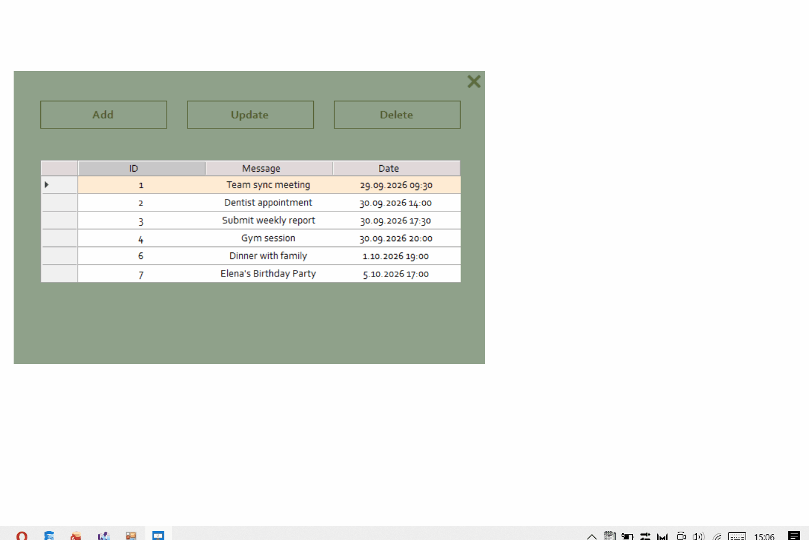
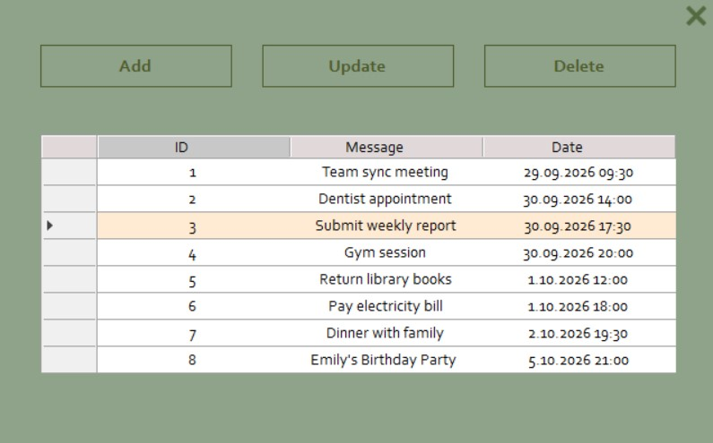
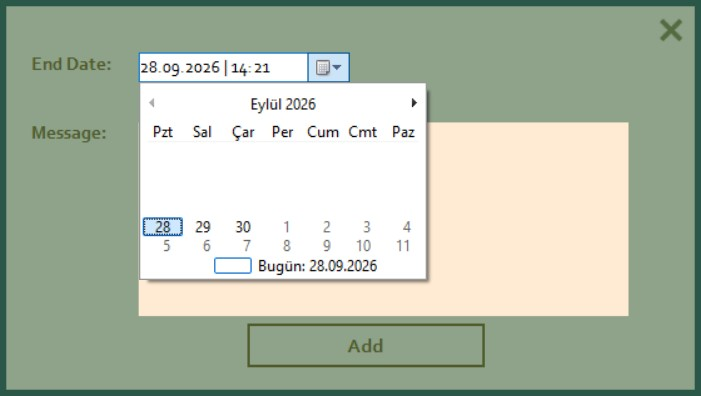
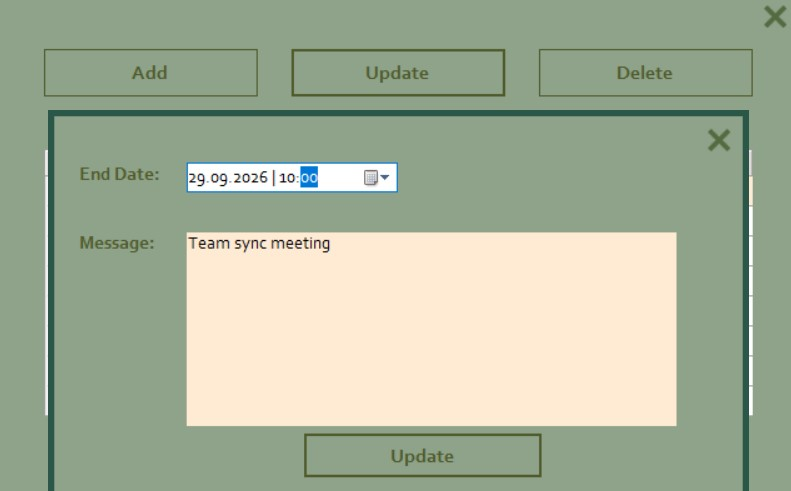
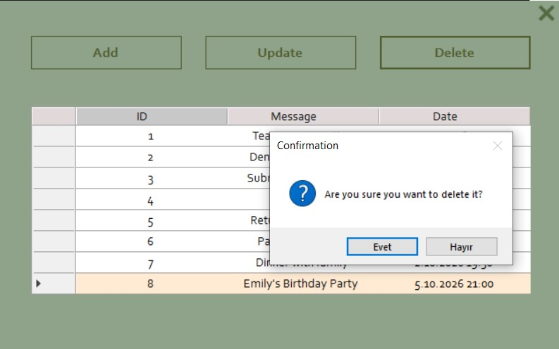

# 📅 Agenda App

> A desktop note and schedule management application built with C# (.NET Framework), Windows Forms, and MS Access (OleDb). It features full CRUD operations for personal notes, automated background timer tracking, contextual notification alerts, and borderless window dragging via native Win32 APIs.

[](https://dotnet.microsoft.com/)
[](https://learn.microsoft.com/en-us/dotnet/csharp/)
[](https://learn.microsoft.com/en-us/dotnet/desktop/winforms/)
[-orange.svg)](https://www.microsoft.com/en-us/microsoft-365/access)
[](LICENSE)

## 📽️ Demo



## 📸 Screenshots

| Main Dashboard (Notes List) | Add Note |
| :---: | :---: |
|  |  |

| Update Note | Delete Note |
| :---: | :---: |
|  |  |

## ✨ Features

* **Full CRUD Operations:** Create, view, update, and delete scheduled notes.
* **Background Timer Monitoring:** Background `Timer` continuously checks for due tasks and notes.
* **Dynamic Notifications:**
  * Shows a `MessageBox` pop-up when the application window is active.
  * Displays a Windows system balloon tip (`NotifyIcon`) when the app is minimized to the system tray.
* **Automatic Expiration Cleanup:** Purges expired/completed tasks from the database after alerting.
* **System Tray Integration:** Runs discreetly in the system tray with custom context menu actions.
* **Custom Draggable Header:** Borderless UI that allows dragging using Win32 `ReleaseCapture` and `SendMessage` APIs.

  ## 🧩 Architecture & Implementation Details

### Data Access Layer (`DatabaseHelper.cs`)
* **Connection Management:** Uses OleDb connection string pointing to `|DataDirectory|\agenda_DB.mdb`.
* **`List()`:** Retrieves all notes into a `DataTable` via `OleDbDataAdapter`.
* **`GetById(int id)`:** Fetches a specific note record for editing.
* **`AddNote(DateTime date, string message)`:** Inserts new notes using parameterized OleDb queries.
* **`UpdateNote(int id, DateTime date, string message)`:** Updates note timestamp and message details.
* **`DeleteNote(int id)`:** Deletes the selected note record by ID.
* **`GetDueNotes(DateTime until)` & `DeleteDueNotes(DateTime until)`:** Queries overdue notes for alerts and removes them after notification.

### Application Forms & Logic
* **`frmMain.cs`:** Main dashboard displaying notes in a `DataGridView`, handling system tray events, delete confirmations, and timer intervals for reminders.
* **`frmAdd.cs`:** Modal form for adding notes with input validation and date restrictions (`date.MinDate = DateTime.Now`).
* **`frmUpdate.cs`:** Modal form pre-populated with note details for editing and saving changes.

  ## 📂 Project Structure

```text
AgendaApp/
│
├── AgendaApp/
│   ├── Properties/
│   ├── frmMain.cs            # Main dashboard, DataGridView, timer and tray logic
│   ├── frmAdd.cs             # Note creation dialog
│   ├── frmUpdate.cs          # Note editing dialog
│   ├── DatabaseHelper.cs     # OleDb ADO.NET database operations
│   ├── Program.cs            # Application entry point
│   └── agenda_DB.mdb         # Access database file
│
├── Screenshots/
│   ├── MainPage.Agenda.jpg   # Main dashboard view
│   ├── AddPage.Agenda.jpg    # Add note dialog
│   ├── UpdatePage.Agenda.jpg # Update note dialog
│   ├── DeletePage.Agenda.jpg # Delete confirmation dialog
│   └── agendaFinal-demo.gif  # Live demo recording
│
├── AgendaApp.slnx            # Solution file
└── README.md                 # Project documentation[](url)

```


## 🚀 Getting Started

### Prerequisites
* Visual Studio (2019, 2022 or newer) with the **.NET desktop development** workload installed.
* **Microsoft Access Database Engine** (ACE.OLEDB.12.0 driver).
### Installation & Setup

1. **Clone the repository:**
`git clone https://github.com/halegulsipahi/AgendaApp.git`

2. **Open Solution:**
Open `AgendaApp.slnx` in Visual Studio.

3. **Configure Database Properties:**
In Solution Explorer, select `AgendaApp/agenda_DB.mdb` and update Properties:
* Copy to Output Directory: **Copy if newer**
* Build Action: **Content**

4. **Platform Configuration:**
Set the build configuration platform (**x86** or **x64**) to match your installed Access Database Engine driver.

5. **Run Application:**
Press **F5** to build and run the application.[](url)


## 👤 Author & Acknowledgments

* **Developer:** Hale Gül Sipahi  
  * GitHub: [@halegulsipahi](https://github.com/halegulsipahi)  
  * LinkedIn: [Hale Gül Sipahi](https://linkedin.com/in/halegulsipahi)

